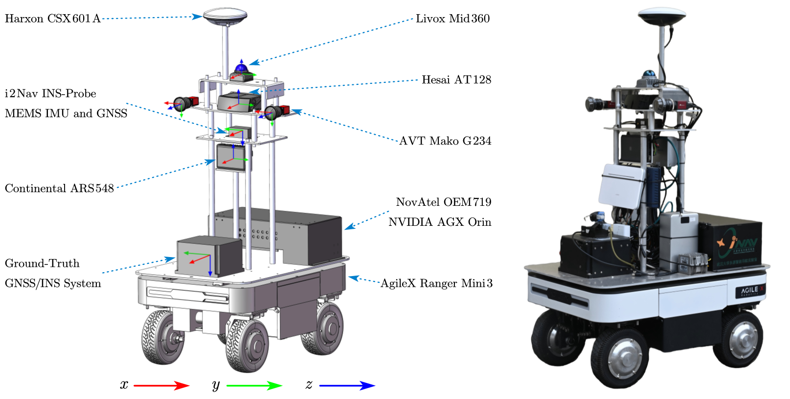
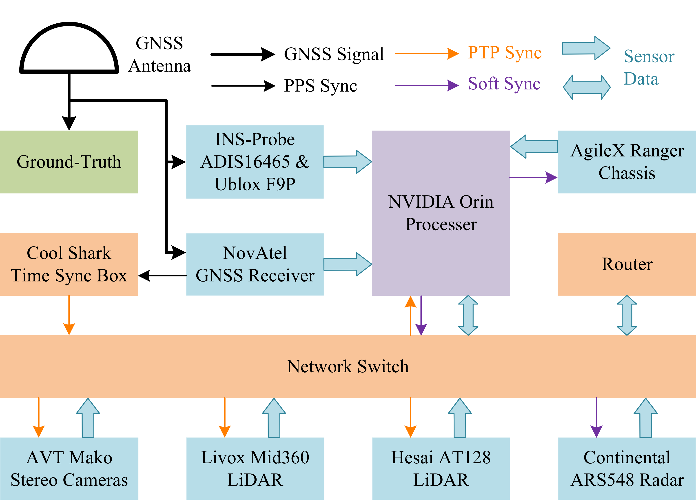
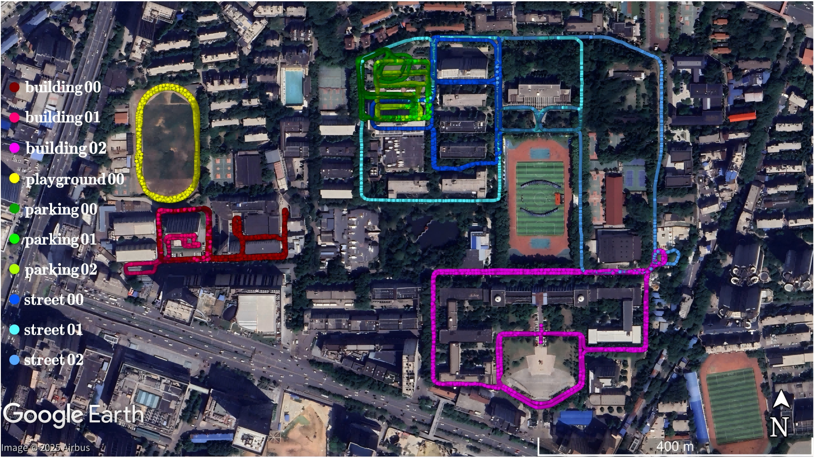
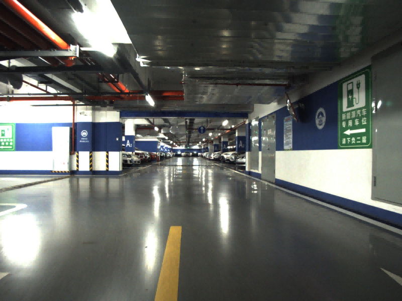

# i2Nav-Robot: A Large-Scale Indoor-Outdoor Robot Dataset for Multi-Sensor Fusion Navigation and Mapping

The Intelligent and Integrated Navigation (i2Nav) group from the GNSS Research Center, Wuhan University, open source a versatile robot dataset, named i2Nav-Robot. This dataset is collected by a wheeled robot in large-scale indoor-outdoor environments, and it is suitable for multi-sensor fusion navigation and mapping. The main features of the i2Nav-Robot dataset are as follows:

- **🚀Complete sensor configuration with precise time synchronization.**
- **⭐Multi-modal perception by stereo camera, LiDAR, and 4D radar.**
- **🌞Indoor-outdoor seamless fusion in complex environments.**
- **🌙10 sequences with a total of 14200 seconds and 17000 meters trajectory.**
- **🚩Accurate ground-truth pose and velocity for all sequences.**


* [i2Nav-Robot: A Large-Scale Indoor-Outdoor Robot Dataset for Multi-Sensor Fusion Navigation and Mapping](#i2nav-robot-a-large-scale-indoor-outdoor-robot-dataset-for-multi-sensor-fusion-navigation-and-mapping)
   * [News](#news)
   * [Download Links](#download-links)
   * [Citation](#citation)
   * [Sensor Setup](#sensor-setup)
      * [Sensors Configuration](#sensors-configuration)
      * [Time Synchronization](#time-synchronization)
      * [Calibration](#calibration)
   * [Ground-truth System](#ground-truth-system)
   * [Dataset Sequences](#dataset-sequences)
      * [ROS Bag File](#ros-bag-file)
      * [Raw Text Files](#raw-text-files)
      * [Data units](#data-units)
      * [Sequences](#sequences)
   * [Tested Benchmark Systems](#tested-benchmark-systems)
      * [Odometry Systems](#odometry-systems)
      * [GNSS-based Systems](#gnss-based-systems)
   * [License](#license)
   * [Contact](#contact)

## News

- [20250818] Add the preprint paper.
- [20250816] Add the calibration file, and the download links. The dataset can be downloaded through [Baidu Wangpan](https://pan.baidu.com/s/1UGZI-LvoTKxH6GN6JbzMZw?pwd=hs6p) or [OneDrive](https://1drv.ms/f/c/7da41598f6f07e02/EgJ-8PaYFaQggH3CBQAAAAABlmP45s_NHaBuLd3xXk04AA?e=sMNBhd)
- [20250628] Create the GitHub Repository. The dataset will be released soon.

## Download Links

We provide both Baidu Wangpan and OneDrive links for users' convenience. You may need about 450GB disk space to download the whole dataset.

- For Baidu Wangpan, please download dataset from [this link](https://pan.baidu.com/s/1UGZI-LvoTKxH6GN6JbzMZw?pwd=hs6p).
- For OneDrive, please download dataset from [this link](https://1drv.ms/f/c/7da41598f6f07e02/EgJ-8PaYFaQggH3CBQAAAAABlmP45s_NHaBuLd3xXk04AA?e=sMNBhd).
- The calibration file is provided along with this repository.

## Citation

If you use i2Nav-Robot dataset in academic researches, please cite our paper.

- Hailiang Tang, Tisheng Zhang, Liqiang Wang, Xin Ding, Man Yuan, Zhiyu Xiang, Jujin Chen, Yuhan Bian, Shuangyan Liu, Yuqing Wang, Guan Wang, and Xiaoji Niu, "i2Nav-Robot: A Large-Scale Indoor-Outdoor Robot Dataset for Multi-Sensor Fusion Navigation and Mapping," Aug. 15, 2025, *arXiv: arXiv:2508.11485*. doi: 10.48550/arXiv.2508.11485.

## Sensor Setup



### Sensors Configuration

| Sensor                                   |                   Type                   | Characteristic                                                                                                                             | Frequency (Hz) |                                       Pictures*                                       |
| :--------------------------------------- | :---------------------------------------: | ------------------------------------------------------------------------------------------------------------------------------------------ | :------------: | :------------------------------------------------------------------------------------: |
| i2Nav INS-Probe<br />(ADIS16465 and F9P) |       🧭GNSS/INS integrated module       | Compact and low-power<br />Built-in MEMS IMU and GNSS module<br />Self-storage system                                                      |       -       |        |
| Harxon CSX601A                           |             🛰️GNSS antenna             | Full GNSS frequency supported                                                                                                              |       -       |        |
| ADI ADIS16465                            |                   🧭IMU                   | 2 °/hr in-run bias stability<br />0.15 °/√hr angular random walk                                                                        |      200      |      |
| Ublox F9P                            |                 🛰️GNSS                 | Multi-system supported<br />L1/L2 double frequency                                                                                    |       1       |                  |
| NovAtel OEM719                           |                 🛰️GNSS                 | Multi-system and multi-frequency supported                                                                                           |       1       |            |
| AVT Mako-G234 (Stereo)                   |                 📷Camera                 | The resolution is configured as 1600*1200<br />Global shutter<br />Color mode                                                              |       10       |                |
| Livox Mid360<br />(Built-in ICM40609)    |                 ⚡️LiDAR                 | Horizontal: 360°, Vertical: -7°\~52°<br />0.1\~40 m @ 10% reflectivity<br />Angular Precision < 0.15°<br />Non-repetitive scanning mode |       10       |            |
| TDK ICM40609                             |                   🧭IMU                   | 4.5 mdps/√Hz<br />100 ug/√Hz                                                                                                             |      200      |        |
| Hesai AT128                              |                 ⚡️LiDAR                 | Horizontal: 120°, Vertical: -12.5°\~12.9°<br />1\~180 m @ 10% reflectivity<br />Angular Precision 0.1° * 0.2°                          |       10       |              |
| Continental ARS548                       |                  📡Radar                  | Horizontal: 120°, Vertical: -20°\~20°<br />Distance range: 0.2\~300 m<br />Distance accuracy: ±0.15 m<br />Speed accuracy: 0.1 m/s      |       20       |          |
| AgileX Ranger MINI3                      | 🛞Odometer<br />(Wheel speeds and angles) | Speed resolution: 0.001 m/s<br />Angle resolution: 0.001 rad                                                                               |       50       |  |
| Cool Shark box                           |             ⏰PTP main clock             | 1.5 us @ 4 hr                                                                                                                              |       -       |    |

*All pictures are obtained from their official website without modification.

### Time Synchronization

The GNSS is the time source for all the system, as shown in the following figure. The ground-truth system, INS-Probe, and Cool Shark box can maintain accurate clocks with their built-in crystal oscillators, even in GNSS-denied indoor environments. The Cool Shark box is the main clock for precision time protocol (PTP) through a local network switch. Hence, the cameras, LiDARs, and NVIDIA Orin can be synchronized to the absolute time with PTP. The ARS548 radar and AgileX chassis are also synchronized precisely even through software synchronization (using the system time when receiving the data), and this is because that the NVIDIA Orin has been synchronized. Besides, the fixed time delays for radar and odometer data can be calibrated offline. The synchronization method for different sensors are listed as follows:

- **GNSS Synchronization**: Ground-truth system, i2Nav INS-Probe, NovAtel Receiver, and Cool Shark box.
- **PTP Synchronization**:  AVT cameras, Livox LiDAR, Hesai LiDAR, and NVIDIA Orin.
- **Software Synchronization with Offline Calibration**:  AgileX chassis and Continental radar.

Note that the cameras are configured in auto-exposure mode. The time stamp for the image denotes the time when the camera is starting to expose, and thus the exposure time is not considered in the time stamp. We really recommend to online estimate the exposure time in your systems, especially for indoor-outdoor sequences.



The GNSS time (GPS time) is composed of the week and the seconds of week (SOW). The time stamp of the ROS message, i.e. the unix second, can be converted to the GNSS time using the following codes.

```python
import math as m

# GPS is now ahead of UTC by 18 seconds
GPS_LEAP_SECOND = 18

def unix_second_to_gps_time(seconds):
    second_gps = seconds + GPS_LEAP_SECOND - 315964800
    week = m.floor(second_gps / 604800)
    sow = second_gps - week * 604800
    return week, sow

def gps_time_to_unix_second(week, sow):
    return sow + week * 604800 + 315964800 - GPS_LEAP_SECOND
```

### Calibration

The intrinsic and extrinsic parameters for stereo cameras are calibrated by MATLAB 2024b using an apriltag board, as shown below. The relative positions for all sensors are obtained from their 3D models, while the relative rotations are not explicitly calibrated. Nevertheless, we provide the camera-IMU and LiDAR-IMU extrinsic parameters (only rotation parameters are estimated), which are online estimated by the open-sourced [LE-VINS](https://github.com/i2Nav-WHU/LE-VINS) and [FF-LINS](https://github.com/i2Nav-WHU/FF-LINS). Besides, the camera-LiDAR extrinsic parameters are calculated with the estimated camera-IMU and LiDAR-IMU extrinsic parameters.

The fixed time offsets for ARS548 radar and Ranger odometer are calibrated by aligning their speed to the ground-truth speed.


## Ground-truth System

The employed ground-truth system is a navigation-grade IMU. The ground-truth accuracy is about **0.02 m for position** and **0.01 deg for attitude**. Note that the ground-truth position, velocity, and attitude are all projected to the **center of ADIS16465 IMU**.

For outdoor environments with good GNSS quality, the ground truth is generated by NovAtel Inertial Explorer (IE) through **post-processing GNSS/INS integration**, using the navigation-grade IMU and the OEM719 receiver.

For indoor and GNSS-challenging environments, we use a LiDAR-based map-matching (MM) method to obtain positioning results, and the Hesai AT128 LiDAR is used. Here, the prebuilt point-cloud map is post-processed by a commercial LiDAR SLAM system, i.e. RS100i-MT from GoSLAM, as shown in the figure. The ground truth is generated by **post-processing MM/INS integration** using the MM positioning results and the navigation-grade IMU. The prebuilt point-cloud map in building environments is exhibited as follows.


## Dataset Sequences

We collected 10 large-scale complex campus environments with indoor and outdoor scenes. The ROS bag files and raw text files are both provided for your convenience. For each sequence, the following files are included (the **\*** denotes the sequence name):

- **\*.bag**: The ROS (ROS1) bag file including all sensor data.
- **\*_ADIS16465_IMU.txt**: The ADIS16465 IMU data in incremental format.
- **\*_F9P_GNSS.pos**: The F9P positioning data in text format.
- **\*_groundtruth.nav**: The ground-truth file with local position, velocity, and attitude.
- **\*_MID360_IMU.txt**: The IMU data from the MID360 LiDAR in incremental format.
- **\*_OEM7_GNSS.pos**: The OEM719 positioning data in text format.
- **\*_RANGER_ODO.txt**: The odometer data from the RANGER chassis in text format.
- **\*_trajectory.csv**: The ground-truth trajectory file.

### ROS Bag File

The contained topics in the ROS (ROS1) bag file are listed in the table.

| Topic                              |   Sensor   | Frequency (Hz) |         Message Type         |  Frame ID  |
| :--------------------------------- | :--------: | :------------: | :--------------------------: | :--------: |
| /adi/adis16465/imu                 |   🧭IMU   |      200      |       sensor_msgs::Imu       | adis16465 |
| /insprobe/adis16465/imu            |   🧭IMU   |      200      |      insprobe_msgs::Imu      | adis16465 |
| /livox/mid360/imu                  |   🧭IMU   |      200      |       sensor_msgs::Imu       | mid360_imu |
| /ublox/f9p/fix                     |  🛰️GNSS  |       1       |    sensor_msgs::NavSatFix    |    f9p    |
| /novatel/oem7/fix                  |  🛰️GNSS  |       1       |    sensor_msgs::NavSatFix    |    oem7    |
| /avt_camera/left/image/compressed  |  📷Camera  |       10       | sensor_msgs::CompressedImage |  left_cam  |
| /avt_camera/right/image/compressed |  📷Camera  |       10       | sensor_msgs::CompressedImage | right_cam |
| /livox/mid360/points               | ⚡️LiDAR |       10       | livox_ros_driver::CustomMsg |   mid360   |
| /hesai/at128/points                | ⚡️LiDAR |       10       |   sensor_msgs::PointCloud2   |   at128   |
| /continental/ars548/detection      |  📡Radar  |       20       |   sensor_msgs::PointCloud2   |   ars548   |
| /continental/ars548/object         |  📡Radar  |       20       |   sensor_msgs::PointCloud2   |   ars548   |
| /insprobe/ranger/odometer          | 🛞Odometer |       50       |   insprobe_msgs::Odometer   |   ranger   |

We use standard sensor messages from the ROS package except for the following messages:

- **insprobe_msgs::Imu**: Use the insprobe_msgs package in this repository.
- **insprobe_msgs::Odometer**: Use the insprobe_msgs package in this repository.
- **livox_ros_driver::CustomMsg**: Please install the [livox_ros_driver2](https://github.com/Livox-SDK/livox_ros_driver2) package.

### Raw Text Files

The formats of the provided raw text files can be found in the following table.

| File                |     Sensor     | Description                                          | Format                                                | Remark                                                     |
| :------------------ | :------------: | :--------------------------------------------------- | :---------------------------------------------------- | :--------------------------------------------------------- |
| *_ADIS16465_IMU.txt |     🧭IMU     | ADIS16465 IMU data                                   | t, dtheta (xyz), dvel (xyz)                           |                                                            |
| *_F9P_GNSS.pos      |    🛰️GNSS    | F9P positioning data (single point positioning, SPP) | t, lat, lon, alt, std (lat, lon, alt)                 | Unavailable for indoor sequences.                          |
| *_groundtruth.nav   | 🧭Ground truth | Ground-truth navigation results                      | t, pos (local NED), vel (NED), att (roll, pitch, yaw) | NED: north-east-down                                       |
| *_MID360_IMU.txt    |     🧭IMU     | IMU data from the MID360 LiDAR                       | t, dtheta (xyz), dvel (xyz)                           |                                                            |
| *_OEM7_GNSS.pos     |    🛰️GNSS    | OEM719 positioning data (real time kinematic, RTK)   | t, lat, lon, alt, std (lat, lon, alt)                 | Unavailable for indoor sequences.                          |
| *_RANGER_ODO.txt    |   🛞Odometer   | Odometer data from the Ranger chassis                | t, wheel speed (1234), wheel angle (1234)             | 1: left front, 2: right front, 3: left back, 4: right back |
| *_trajectory.csv    | 🧭Ground truth | Ground-truth trajectory                              | t, pos (local NED), quat (xyzw)                       | TUM format |

### Data units

The data units for ROS messages and raw text files are described in the table.

|                    Data                    |                  Unit                  |
| :-----------------------------------------: | :------------------------------------: |
|               Time stamp (t)               |             second ($s$)             |
| Position (pos) and standard deviation (std) |             meter ($m$)             |
|          Velocity (vel) and speed          |       meter per second ($m/s$)       |
|         Attitude (roll, pitch, yaw)         |            degree ($°$)            |
|        Wheel angle (Ranger chassis)        |            radian ($rad$)            |
|      Latitude and longitude (lat, lon)      |            degree ($°$)            |
|               Altitude (alt)               |             meter ($m$)             |
|       IMU incremental angle (dtheta)       |            radian ($rad$)            |
|       IMU incremental velocity (dvel)       |       meter per second ($m/s$)       |
|            IMU angular velocity            |     radian per second ($rad/s$)     |
|           IMU linear acceleration           | meter per second squared ($m/{s^2}$) |

### Sequences

Ten sequences are collected in large-scale indoor and outdoor environments. The testing scenes and trajectories are shown in the following figure.



The detailed information about the ten sequences is exhibited in the table.

|     Sequence     | Duration (s) | Trajectory (m) |                                          Map                                          |                                          Scene                                          |
| :--------------: | :----------: | :------------: | :------------------------------------------------------------------------------------: | :--------------------------------------------------------------------------------------: |
|  *building00*  |     1201     |      1673      |      |      |
|  *building01*  |     1369     |      1730      |      |      |
|  *building02*  |     2110     |      2522      |      |      |
|  *parking00*  |     1141     |      1583      |        |        |
|  *parking01*  |     1060     |      1224      |        |        |
|  *parking02*  |     1257     |      1442      |        |        |
| *playground00* |     1786     |      1711      |  |  |
|   *street00*   |     1380     |      1668      |          |          |
|   *street01*   |     1520     |      1660      |          |          |
|   *street02*   |     1380     |      1847      |          |          |
|      Total      |    14204    |     17060     |                                           -                                           |                                            -                                            |

The ground truth systems for these sequences are as follows:

- **MM/INS integration**: *building00*, *building01*, *parking00*, *parking01*, *parking02*.
- **GNSS/INS integration**: *building02*, *playground00*, *street00*, *street01*, *street02*.

## Tested Benchmark Systems

### Odometry Systems

The latest or classical visual-inertial odometry (VIO), LiDAR-inertial odometry (LIO), and LiDAR-visual-inertial odometry (LVIO) are tested on i2Nav-Robot datasets. The left AVT camera, the Hesai AT128 LiDAR, and the ADIS16465 IMU are employed for testing. The tested systems are as follows:

- [VINS-Mono](https://github.com/HKUST-Aerial-Robotics/VINS-Mono): A Robust and Versatile Monocular Visual-Inertial State Estimator
- [DM-VIO](https://github.com/lukasvst/dm-vio): Delayed Marginalization Visual-Inertial Odometry
- [OpenVINS](https://github.com/rpng/open_vins): A MSCKF-based visual-inertial estimator
- [DLIO](https://github.com/vectr-ucla/direct_lidar_inertial_odometry): Direct LiDAR-Inertial Odometry: Lightweight LIO with Continuous-Time Motion Correction
- [FF-LINS](https://github.com/i2Nav-WHU/FF-LINS): A Consistent Frame-to-Frame Solid-State-LiDAR-Inertial State Estimator
- [FAST-LIO2](https://github.com/hku-mars/FAST_LIO): Fast Direct LiDAR-Inertial Odometry
- [FAST-LIVO2](https://github.com/hku-mars/FAST-LIVO2): Fast, Direct LiDAR–Inertial–Visual Odometry
- [LE-VINS](https://github.com/i2Nav-WHU/LE-VINS): INS-Centric Visual-Inertial Navigation System With LiDAR Enhancement
- [R3LIVE](https://github.com/hku-mars/r3live): A Robust, Real-time, RGB-colored, LiDAR-Inertial-Visual tightly-coupled state Estimation and mapping package

The odometry results are shown in the following table.

| ARE (°) / ATE  (m) |  VINS-Mono  |    DM-VIO    | OpenVINS<br />(Stereo) |    DLIO    |   FF-LINS   |  FAST-LIO2  | FAST-LIVO2 |   LE-VINS   |   R3LIVE   |
| :-----------------: | :---------: | :----------: | :--------------------: | :---------: | :---------: | :---------: | :---------: | :---------: | :---------: |
|       Sensors       |     VI     |      VI      |           VI           |     LI     |     LI     |     LI     |     LVI     |     LVI     |     LVI     |
|   *building00*   | 0.48 / 3.95 | 0.52 / 2.45 |      1.34 / 3.36      | 0.90 / 0.39 | 2.19 / 2.32 | 1.20 / 0.68 | 0.91 / 1.10 | 0.39 / 1.17 |   Failed   |
|   *building01*   | 0.74 / 2.74 | 0.76 / 2.42 |      0.86 / 1.13      | 0.86 / 0.43 | 1.35 / 1.16 | 0.93 / 0.38 | 0.43 / 0.19 | 0.36 / 1.01 |   Failed   |
|   *building02*   | 1.21 / 6.51 | 0.34 / 10.31 |      0.34 / 1.48      | 8.56 / 9.62 | 2.82 / 6.73 | 0.76 / 1.46 | 1.04 / 1.65 | 0.79 / 2.35 | 1.70 / 4.49 |
|    *parking00*    | 1.14 / 7.53 | 0.37 / 1.19 |      0.33 / 0.88      | 0.73 / 0.46 | 2.48 / 1.94 | 0.45 / 0.25 | 0.56 / 0.26 | 0.50 / 0.98 | 1.12 / 0.59 |
|    *parking01*    | 3.67 / 3.86 | 0.83 / 2.33 |      0.34 / 0.81      | 0.58 / 0.15 | 1.69 / 1.06 | 1.21 / 0.44 | 0.65 / 0.17 | 0.30 / 0.69 | 0.91 / 0.39 |
|    *parking02*    | 3.13 / 3.24 | 0.85 / 1.31 |      2.34 / 3.47      | 1.08 / 0.56 | 1.64 / 1.31 | 2.07 / 1.46 | 0.65 / 0.18 | 0.69 / 0.79 | 1.37 / 0.66 |
|  *playground00*  | 0.51 / 2.59 | 0.85 / 8.07 |      0.92 / 1.62      | 8.21 / 0.44 | 1.43 / 1.71 | 0.41 / 0.31 | 0.49 / 0.53 | 0.84 / 1.34 | 0.52 / 0.62 |
|    *street00*    | 0.57 / 3.81 |    Failed    |      0.84 / 1.60      | 0.73 / 0.79 | 2.22 / 3.32 | 1.38 / 1.86 | 0.81 / 1.12 | 0.53 / 1.18 | 1.34 / 1.61 |
|    *street01*    | 1.07 / 8.71 | 0.64 / 3.44 |      0.37 / 1.11      | 8.84 / 4.31 | 1.75 / 4.20 | 0.72 / 1.28 | 1.15 / 2.45 | 0.34 / 1.65 | 1.43 / 2.36 |
|    *street02*    | 0.83 / 6.72 | 1.35 / 7.43 |      0.46 / 1.61      | 1.39 / 3.15 | 1.95 / 3.78 | 0.91 / 1.49 | 1.19 / 2.92 | 0.51 / 2.16 | 1.32 / 1.40 |
|         RMS         | 1.71 / 5.38 |   Invalid   |      1.01 / 1.93      | 4.74 / 3.50 | 2.00 / 3.23 | 1.11 / 1.12 | 0.83 / 1.42 | 0.55 / 1.43 |   Invalid   |

### GNSS-based Systems

We provide centimeter-level RTK results from the NovAtel OEM719 GNSS Receiver. However, there are lots of outliers due to the complex environments, which is of great challenge for accurate positioning. The following GNSS-based systems have been tested:

- [KF-GINS](https://github.com/i2Nav-WHU/KF-GINS): An EKF-Based GNSS/INS Integrated Navigation System
- [OB-GINS](https://github.com/i2Nav-WHU/OB_GINS): An Optimization-Based GNSS/INS Integrated Navigation System
- [VINS-Fusion](https://github.com/HKUST-Aerial-Robotics/VINS-Fusion): An optimization-based multi-sensor state estimator
- [IC-GVINS](https://github.com/i2Nav-WHU/IC-GVINS): A Robust, Real-time, INS-Centric GNSS-Visual-Inertial Navigation System

The multi-sensor fusion positioning results are shown in the following table.

| ARE (°) / ATE (m) |    KF-GINS    |    OB-GINS    | VINS-Fusion (Mono) |  IC-GVINS  |
| :----------------: | :-----------: | :-----------: | :----------------: | :---------: |
|   *building00*   | 66.08 / 13.91 |  1.66 / 8.46  |   36.60 / 14.04   | 0.30 / 0.72 |
|   *building01*   | 9.45 / 11.26 | 10.22 / 12.16 |    9.12 / 10.83    | 0.36 / 0.33 |
|   *building02*   |  1.75 / 2.72  |  1.37 / 2.80  |    8.27 / 2.80    | 0.23 / 0.23 |
|   *parking00*   | 34.16 / 23.28 | 24.75 / 23.87 |   24.20 / 23.25   | 0.49 / 0.74 |
|  *playground00*  |  0.56 / 0.40  |  1.17 / 0.40  |    9.40 / 0.31    | 0.15 / 0.11 |
|    *street00*    |  1.28 / 0.40  |  1.78 / 0.40  |    1.42 / 0.29    | 0.15 / 0.10 |
|    *street01*    |  1.20 / 0.48  |  1.06 / 0.48  |    0.89 / 0.29    | 0.46 / 0.29 |
|    *street02*    |  0.70 / 0.42  |  1.51 / 0.42  |    4.11 / 0.26    | 0.19 / 0.12 |
|        RMS        | 26.53 / 10.43 |  9.55 / 9.98  |   16.53 / 10.39   | 0.32 / 0.41 |

## License

The i2Nav-Robot dataset is released under GPLv3 license. This dataset can only be used for academic purposes.

## Contact

Please contact **Dr. Hailiang Tang** ([thl@whu.edu.cn](mailto:thl@whu.edu.cn)) or open an issue at this repository for any technical issues. You can also join our QQ group (**481173293**) to discuss with other researchers.
